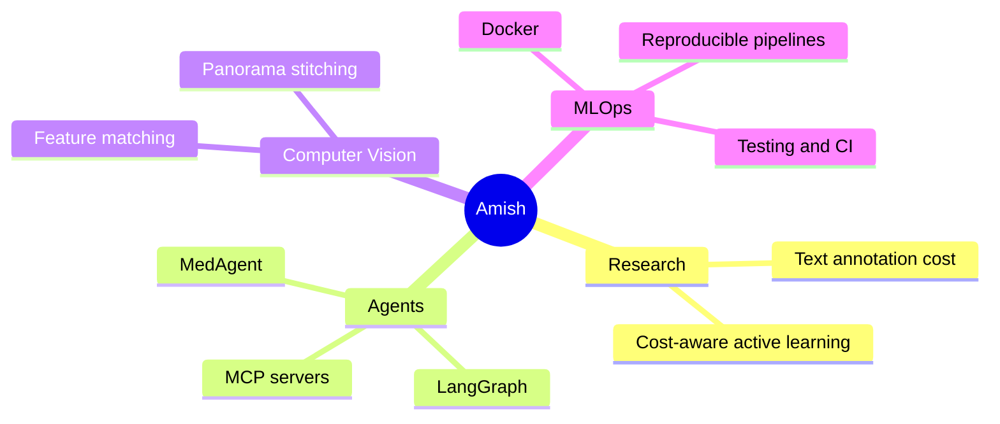

  
  
  

  
  

---

## 👋 About me
B.Tech CSE (AI & ML) student at **VIT Bhopal** (2024–2028). I recently interned in **AI & Data Analytics at Tech Mahindra**, where I built LLM-based agentic workflows and streamlined enterprise data pipelines. I like turning ML ideas into things that actually run: deployed apps, Dockerised jobs, and reproducible experiments.

🔬 **Researching** cost-aware active learning: cutting text-annotation cost with uncertainty and knapsack-based sample selection  
🤖 **Building** MedAgent, an AI agent marketplace on LangGraph and MCP  
📷 **Exploring** classical computer vision, from feature matching to panorama stitching  
🤝 **Open to** AI/ML and software engineering internships, including in Japan and Asia-Pacific

---

## 💼 Experience
| Role | What I did |
|---|---|
| **AI & Data Analytics Intern**, Tech Mahindra (May–Aug 2026) | Streamlined 3 enterprise data pipelines, cutting manual analysis time by 35%. Designed and integrated 2 LLM-based agentic workflows (LangGraph, MCP servers) into internal tools, making prototype-to-review 40% faster. |
| **Data Science Intern**, Finlatics (Apr–Jun 2026, remote) | Applied 5 statistical/ML techniques to multi-variable datasets (+20% prediction accuracy) and delivered 3 end-to-end data analysis projects. |

---

## 🚀 Featured Projects
| Project | What it does | Tech |
|---|---|---|
| [**MedAgent**](https://github.com/Amish23102006/medagent) · [live demo](https://medagent-rust.vercel.app) | Marketplace chaining 10 AI agents across 6 medical domains. Each agent is a reusable MCP tool, and a no-code console lets non-technical users build pipelines in minutes. | `LangGraph` `LangChain` `MCP` `Node.js` `React` |
| [**Cost-Aware Active Learning**](https://github.com/Amish23102006/cost-aware-active-learning) | Empirical study of when cost-aware sample selection beats uncertainty sampling for text annotation. | `Python` `scikit-learn` |
| [**Fake Text Detection**](https://github.com/Amish23102006/fake-text-detection) | Separates AI-generated from human-written text using stylometric features. ~83% accuracy on a held-out, length-matched test set, with an ablation across feature families. | `Python` `scikit-learn` `NLP` |
| [**Panorama-Stitcher**](https://github.com/Amish23102006/panorama-stitcher) | CLI panorama pipeline: SIFT/ORB, Lowe's ratio test, RANSAC homography. | `Python` `OpenCV` |
| [**PrimetradeAI-ML**](https://github.com/Amish23102006/PrimetradeAI-ML) | Dockerised MLOps batch job with config, logging, metrics output and unit tests. | `Python` `pandas` `Docker` |
| [**Resume Analyzer**](https://github.com/Amish23102006/resume-analyzer-java) | Java Swing mini-ATS that scores resumes by cosine similarity. | `Java` `Swing` `NLP` |
| [**Open Source Audit**](https://github.com/Amish23102006/open-source-audit) | Git repository audit built from five Bash scripts. | `Bash` `Linux` `Git` |

---

## 🛠️ Tech Stack

**Languages**  

**ML / Data / Agents**  

**Backend / Cloud / Tools**  

---

## 🎯 Currently focused on

---

## 🏅 Achievements & Certifications
- 🏆 Top 10 of 50 teams, Health Hackathon 2026 (AI health solution)
- 💡 50+ problems solved on Codeforces
- ☁️ Microsoft Certified: MLOps Engineer Associate (2026)
- 📚 Deep Learning Specialization (Coursera) · Supervised ML (DeepLearning.AI)
- 🥋 Tech Mahindra AI White, Blue & Brown Belt (2026)

---

## 📊 GitHub Analytics

  
  

  

  

---

## 📫 Let's connect
I'm always happy to talk about ML, agents, MLOps, or internship opportunities.

  
  
  

<!-- Add a line here once your CV is hosted: 📄 [Resume](link) -->

  

